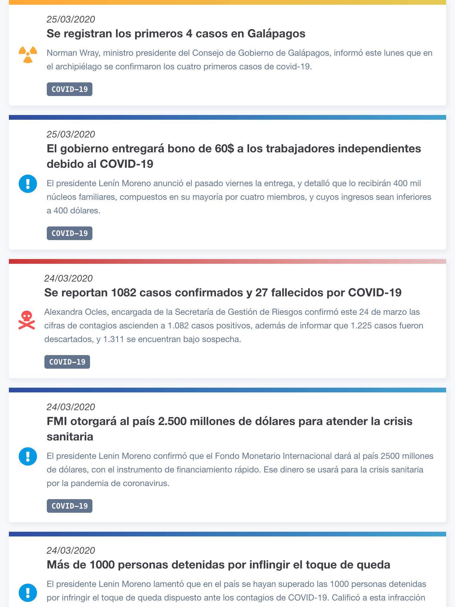

# AlertasEc

Esta aplicación fue diseñada con el objetivo de llevar un registro histórico de fuentes oficiales sobre las alertas en Ecuador con respecto al coronavirus (COVID-19), debido a que con la aparición de *fake news* relacionadas a este tema era importante contar con una fuente confiable para conocer en orden cronológico las decisiones oficiales.

